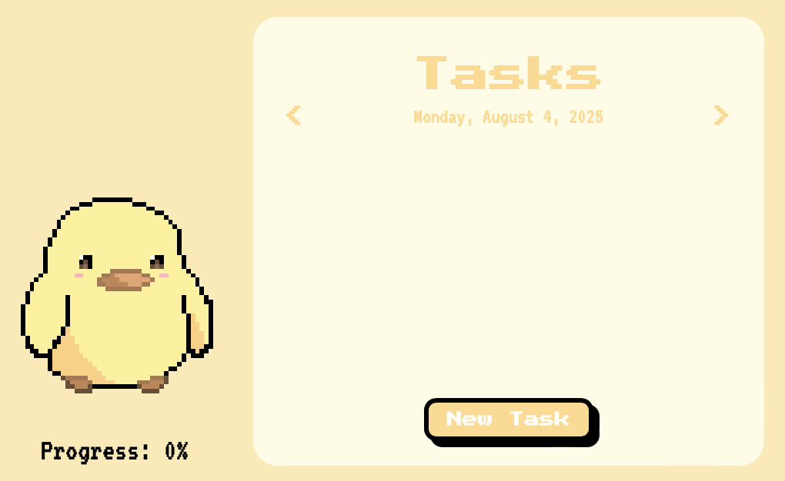
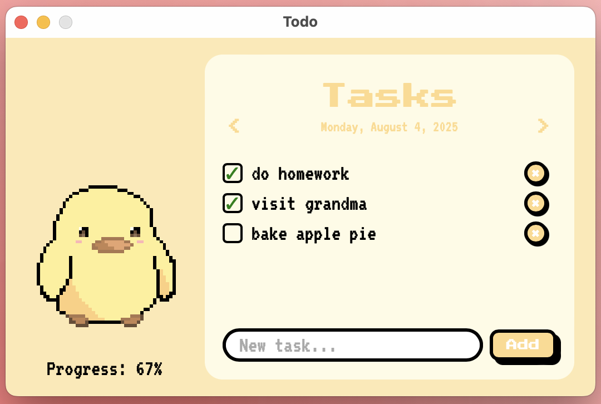
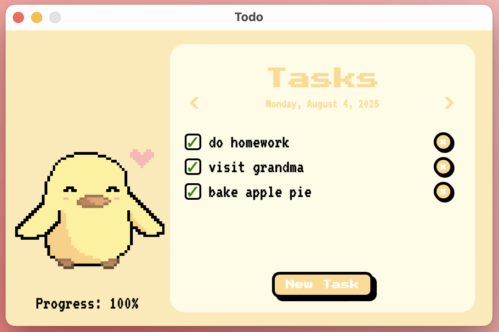

# 🎯 Todo - Retro To-Do List

Get your tasks done with **Todo** – a minimalist, retro-styled task companion 🐤. A small and playful to-do list app featuring pixel-art style. Built with HTML, CSS, JavaScript, and Tauri to run as a fast, lightweight desktop application.

---

## ✨ Features

- Add, delete, and check off daily tasks
- Navigate through days (yesterday/today/tomorrow)
- Persistent local task storage (per date)
- Animated progress tracker
- Stylish pixel-art UI & themed checkboxes
- Fast & tiny desktop app via Tauri
- macOS & Windows support

 

---

## 🖥️ Installation

### macOS

1. Clone this repository:
   git clone https://github.com/ivcabb/TodoList.git
   cd TodoList
2.	Install dependencies:
    npm install
3.	Run the app in development:
    npm run tauri:dev
4.	Build the final app:
    npm run tauri:build

After building, you’ll find your macOS .app bundle in: 
    src-tauri/target/release/bundle/macos/

---

## 👤 Author

Created by @ivcabb
Pixel art & design: original artwork
Icons: original creations
